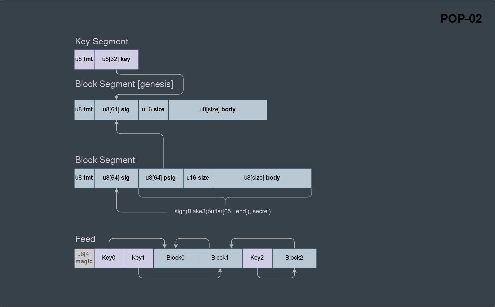

# POP-02: Binary Block and Chain

Purpose:
 - A **verifiable** and highly **transferable** data container.
 - Flat memory format, zero copy on read.
 - Append on write.
 - Compatiblity with most modern digital devices.
 - The simpler the better.



There are two types of Segments: Key and Block.

## Key Segment
POP-01 public keys are simply prefixed with a `(`
`(<32bytes>`

<small>Sample in hex</small>
```
6a922f9723ee10039f73320bcc111893939100150a8216d955c00b3ee3a3cdf5a8
```

## Block Segment
A block is binary data prepended with a signature.

A plain buffer containing the following components:

- `Fmt` A single byte identifying the format of blocks
- `SIG` Signature = `sign(blake3(PSIG + SIZE + BODY))` // See POP-01
- `PSIG` Parent Signature: optional, 64 zeros denotes genesis block
- `SIZE` two or four bytes. Lite 64KB / Phat (soft limit 16MB)
- `Body` a buffer of data with length equal to `SIZE`.

Note: `SIG` is synonymous with `BlockID`

<small>Sample in hex</small>
```
29462e2c9f195b400019908bc747a279597c56b32ead05d2a351100c26e4c4eeb8ac698a59a2d165cbaec07481c3cf3624b0d82b4d6b340a52aa26e3c5acec392b00046861636b
```

### Header

The header starts with one byte that specifies the block format.

**Fmt Byte**  

Bit 7 being the highest bit and 0 the lowest.

| bit | name     | value                            |
|-----|----------|----------------------------------|
| 0   | Type     | `0`: KEY, `1`: BLOCK             |
| 1   | Genesis  | `0`: No PSIG, 1: PSIG after SIG  |
| 2   | Phat     | Size is `0`:  u16, `1`: u32      |
| 3   | Chain    | `0`: End of Chain, `1`: not last |
| 4   | RESERVED | Always `0`                       |
| 5   | RESERVED | Always `1`                       |
| 6   | RESERVED | Always `0`                       |
| 7   | RESERVED | Always `0`                       |

**Section offsets**

| Type         | Fmt Bin   | Fmt Char | @SIG | @PSIG | @SIZE | @BODY |
|--------------|-----------|----------|------|-------|-------|-------|
| Lite Genesis | 0010 0001 | !        | 1    | n/a   | 65    | 67    |
| Phat Genesis | 0010 0011 | #        | 1    | n/a   | 65    | 69    |
| Lite Child   | 0010 0101 | %        | 1    | 65    | 129   | 131   |
| Phat Child   | 0010 0111 | '        | 1    | 65    | 129   | 133   |
| KEY (32B)    | 0110 1010 | k        | n/a  | n/a   | n/a   | n/a   |

## Chain

A chain is a flat buffer that contains a set of keys and blocks  
where each subsequent block _Parent Signature_ equals the  
signature of it's predecessor.

This provides a simple way to transmit verifiable data between nodes.

All keys required to validate the chain _should_ be included, but a key _must_ never
occur after a block that depends on it.

The start of chain is denoted by the magic-bytes:
> This part of the spec is **optional**, a block can be
> transported/persisted without being prepended with `PIC0`


| Magic | Hex            | Description                   |
|-------|----------------|-------------------------------|
| PIC0  | 80, 73, 67, 48 | Pico Internet Chain version 0 |


Example: hex encoded chain with 1 key and 2 blocks

```
807367486a922f9723ee10039f73320bcc111893939100150a8216d955c00b3ee3a3cdf5a821462e2c9f195b400019908bc747a279597c56b32ead05d2a351100c26e4c4eeb8ac698a59a2d165cbaec07481c3cf3624b0d82b4d6b340a52aa26e3c5acec392b00046861636b2b80f9fd730c2733d5ef36965aa1336509434552f7fd57a031b1ea5ddc41e09d15b6462d0acb300cc183dd7d56d60f5251fe6714525866d24d10ad00c80ced8e46462e2c9f195b400019908bc747a279597c56b32ead05d2a351100c26e4c4eeb8ac698a59a2d165cbaec07481c3cf3624b0d82b4d6b340a52aa26e3c5acec392b0006706c616e6574
```

